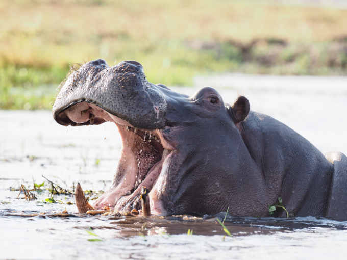

저는 한세사이버보안고등학교에 재학중인 이현서 입니다.

저희 학교는 다 좋지만 이레, 조준영 같은 짐승들이 서식중인 위험한 곳 입니다.

어? 어떻게 이 험난한 곳에서 살아남을수 있냐구요? 지금 알려드리죠
[salted duck eggs](https://en.wikipedia.org/wiki/Salted_duck_egg).

> 첫번째 동물은 이레입니다. 이레는 96kg에 육박하는 거대 생물입니다. 최상위 포식자에 속해있죠. 이레를 상대하는법은 간단합니다.
> 다리를 노리세요. 다리를 노린다면 자기 자신의 무게를 지탱하지 못하고 쓰러질 것입니다. 그후 파운딩으로 족치시면 됩니다.
> 두번째 동물은 조준영입니다. 그는 매우 약하지만 강한척하는 생물이기 때문에 쫄 필요가 없습니다.
> 그냥 팩트로 입만 터시면 생존하실수 있습니다. 절대로 쫄거나 당해주시면 안됩니다. 그러면 자기 자신보다 약한 생물이라고 인식하기 때문에 먹잇감이 될 수 있습니다.
> 세번째 동물은 강하진 않지만 그냥 상대하기 까다로운 동물입니다. 바로 이서현이죠.
> 이서현은 매우매우 약합니다. 하지만 바퀴벌레 처럼 엄청나게 생존력이 강하죠.
>  상대법은 조금 까다롭지만 조금만 다르게 생각해보면 간단합니다. 그냥 무시를 하시면 됩니다. 무시를 한다면 그의 주 먹이는 관심이기 때문에, 굶어 죽을것 입니다. 조금 생각해보면 한세고등학교도 살아남기 쉬운 곳 일수도 있겠네요.



한세에서 살아남고, 추천 부탁드립니다.

```js
다음은 수업시간에 살아남은 방법입니다. (진짜 꿀팁)
```

| Number | 살아남는 꿀팁                             | Year |
| :----- | :--------------------------------------- | ---: |
| 1      | 어그로 안끄는법                           | 2001 |
| 2      | 몰래 자는법                               | 2002 |
| 3      | 실습 시간, 몰래 게임하는법                 | 2004 |

[View raw (TEST.md)](https://raw.github.com/adamschwartz/github-markdown-kitchen-sink/master/README.md)

꿀팁

    뒷감당은 알아서 하셔야합니다.

# 어그로 안끄는법

## 오히려 조금 어그로를 끌자

    조용히 있는것 보다 오히려 조금 시끄럽게 하면 선생님의 눈초리를 피할수 있다.
    ========

    사용 하고있는지는 모르겠지만, 같은반에 다른 관종이 있다면 "베이팅" 하도록 하자.
    --------

# Header 1

## Header 2

### Header 3

#### Header 4

##### Header 5

###### Header 6

    # Header 1
    ## Header 2
    ### Header 3
    #### Header 4
    ##### Header 5
    ###### Header 6

# Header 1

## Header 2

### Header 3

#### Header 4

##### Header 5

###### Header 6

    # Header 1 #
    ## Header 2 ##
    ### Header 3 ###
    #### Header 4 ####
    ##### Header 5 #####
    ###### Header 6 ######

> Lorem ipsum dolor sit amet, consectetuer adipiscing elit. Aliquam hendrerit mi posuere lectus. Vestibulum enim wisi, viverra nec, fringilla in, laoreet vitae, risus.

    > Lorem ipsum dolor sit amet, consectetuer adipiscing elit. Aliquam hendrerit mi posuere lectus. Vestibulum enim wisi, viverra nec, fringilla in, laoreet vitae, risus.

> ## This is a header.
>
> 1. This is the first list item.
> 2. This is the second list item.
>
> Here's some example code:
>
>     Markdown.generate();

    > ## This is a header.
    > 1. This is the first list item.
    > 2. This is the second list item.
    >
    > Here's some example code:
    >
    >     Markdown.generate();

- Red
- Green
- Blue

* Red
* Green
* Blue

- Red
- Green
- Blue

```markdown
- Red
- Green
- Blue

* Red
* Green
* Blue

- Red
- Green
- Blue
```

- `code goes` here in this line
- **bold** goes here

```markdown
- `code goes` here in this line
- **bold** goes here
```

1. Buy flour and salt
1. Mix together with water
1. Bake

```markdown
1. Buy flour and salt
1. Mix together with water
1. Bake
```

1. `code goes` here in this line
1. **bold** goes here

```markdown
1. `code goes` here in this line
1. **bold** goes here
```

Paragraph:

    Code

<!-- -->

    Paragraph:

        Code

---

---

---

---

---

    * * *

    ***

    *****

    - - -

    ---------------------------------------

This is [an example](http://example.com "Example") link.

[This link](http://example.com) has no title attr.

This is [an example][id] reference-style link.

[id]: http://example.com "Optional Title"

    This is [an example](http://example.com "Example") link.

    [This link](http://example.com) has no title attr.

    This is [an example] [id] reference-style link.

    [id]: http://example.com "Optional Title"

_single asterisks_

_single underscores_

**double asterisks**

**double underscores**

    *single asterisks*

    _single underscores_

    **double asterisks**

    __double underscores__

This paragraph has some `code` in it.

    This paragraph has some `code` in it.


    
